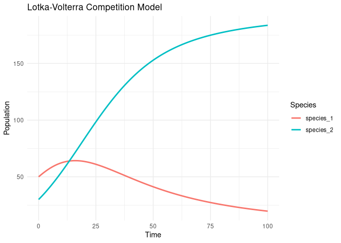

<!-- README.md is generated from README.Rmd. Please edit that file -->

# evolmod

<!-- badges: start -->
<!-- badges: end -->

The goal of evolmod is to create basic evolutionary models for learning
purposes.

## Installation

You can install the development version of evolmod from
[GitHub](https://github.com/) with:

``` r
# install.packages("devtools")
devtools::install_github("CanElverici/evolmod")
```

## Example

This is a basic example which makes a very basic lotka-volterra model:

``` r
library(evolmod)
## basic example code
initial_conditions <- c(x1 = 50, x2 = 30)
parameters <- c(r1 = 0.1, r2 = 0.1, K1 = 100, K2 = 200, alpha = 0.5, beta = 0.7)
time <- seq(0, 100, by = 0.1)
results_df <- lotka_volterra_competition(initial_conditions, parameters, time)

lotka_volterra_plot(results_df)
```


